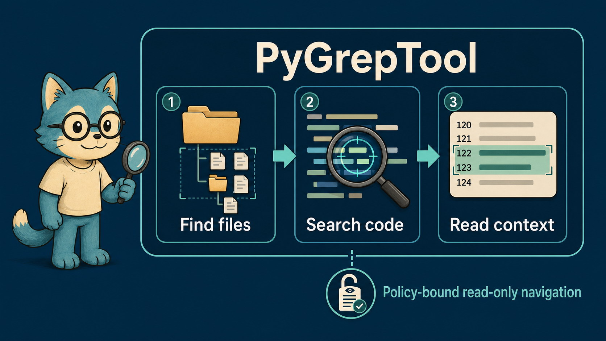

# PyGrepTool

> AI agent를 위한 policy-bound, read-only 코드 탐색 도구



[English](README.md)

PyGrepTool은 agent가 파일을 찾고, 정확한 문자열·정규식을 검색하고, 답변에 필요한 줄만 읽도록 돕습니다. vector DB나 사전 인덱스 없이 가상 경로, 줄 근거, 제한된 문맥, 명시적인 policy 차단 결과를 반환합니다.

이 도구는 Docker, VM, remote workspace 같은 **실제 격리 경계 안에서** 사용하도록 설계되었습니다. 자체 policy는 file tool이 공개할 수 있는 범위를 좁히지만, process 격리를 대체하지는 않습니다.

## 왜 PyGrepTool인가

`rg`는 신뢰할 수 있는 환경에서 사람이 쓰기에는 훌륭하지만, agent용 접근 경계나 결과 계약을 정의하지는 않습니다. 반대로 일반 파일 관리 toolkit은 코드 탐색 agent에 필요 이상으로 넓은 파일시스템 권한을 노출할 수 있습니다.

PyGrepTool은 필요한 read-only surface만 남깁니다.

- `find_files`: 폴더, 파일명 일부, 확장자로 후보 파일을 찾습니다.
- `search_code`: 정확한 문자열 또는 정규식을 찾고 줄 근거를 반환합니다.
- `read_context`: 선택한 위치 주변만 제한해서 읽습니다.

| 제공하는 것 | 의도적으로 제공하지 않는 것 |
| --- | --- |
| `rg → grep → Python` 검색 fallback | Docker, VM, process sandbox |
| 가상 경로와 `allowed_roots` 강제 | shell, write, delete, move, network tool |
| ignore 규칙, secret path 차단, redaction, scan budget | embedding, vector search, indexing, call graph |
| 구조화된 tool 결과와 선택적 LangChain adapter | 숨겨진 prompt나 미리 만들어진 agent |

## 빠른 시작

PyGrepTool 자체에는 필수 runtime dependency가 없습니다. 저장소를 받은 뒤 tool을 호스팅할 Python 환경에 설치하세요.

```powershell
python -m pip install -e .
pygreptool TODO src --json
pygrep-tool --schema responses --pretty
```

선택적 extra입니다.

```powershell
# Python backend에서 .gitignore/.pygrepignore 호환 패턴 사용
python -m pip install -e ".[ignore]"

# LangChain tool adapter만 사용
python -m pip install -e ".[langchain]"

# 실행 가능한 OpenAI/LangChain 예제까지 사용
python -m pip install -e ".[agent]"
```

### 내 LangChain agent에 tool만 추가하기

PyGrepTool은 agent를 생성하거나 소유하지 않습니다. 애플리케이션이 model, prompt, 기존 tool을 소유하고 navigation toolkit만 추가합니다.

```python
from langchain.agents import create_agent
from langchain_openai import ChatOpenAI

from pygreptool import CodeAccessPolicy
from pygreptool.langchain_toolkit import create_pygrep_tools

navigation_tools = create_pygrep_tools(
    workspace_root="/workspace/project",
    allowed_roots=["src", "tests"],
    virtual_mode=True,
    policy=CodeAccessPolicy(),
)

agent = create_agent(
    model=ChatOpenAI(model="gpt-4o-mini", temperature=0),
    tools=[*application_tools, *navigation_tools],
    system_prompt=(
        "Use find_files for filenames or extensions, search_code for file contents, "
        "and read_context only when additional lines are needed."
    ),
)
```

`create_pygrep_tools()`는 `find_files`, `search_code`, `read_context`를 반환합니다. 작은 모델도 discovery, 내용 검색, 좁은 후속 읽기의 역할을 구분하도록 description을 작성했습니다. 반드시 `find_files → search_code → read_context` 순서로 호출할 필요는 없습니다. 사용자가 이미 허용된 정확한 파일 경로와 줄을 주었다면 `read_context`를 바로 쓰세요.

애플리케이션이 agent를 소유하는 예제에서 tool 선택과 argument를 보려면 다음을 실행하세요.

```powershell
python examples\compose_your_own_agent.py --trace "Find where BackendName is defined and cite the line number."
```

예제는 provider 초기화를 위해 `.env`를 읽지만 값을 출력하지 않습니다.

## 보안 모델과 배포 경계

`virtual_mode=True`이면 `workspace_root`는 agent에게 `/`로 보입니다.

```text
agent path:  /src/main.py
physical:    /workspace/project/src/main.py
```

tool은 `..`, `~`, Windows drive/UNC 경로, `allowed_roots` 밖으로 resolve되는 경로를 거부합니다. allowlist 밖으로 나가는 symlink도 제외합니다. virtual mode의 오류 응답은 물리 workspace 경로를 숨기고, 기존 allowed root를 쓰거나 host에 좁은 범위의 승인을 요청하도록 안내합니다. 경로 변형을 통한 재시도·우회는 안내하지 않습니다. `CodeAccessPolicy`는 `.env`, `.git`, `credentials.yml`, PEM/key 파일처럼 흔한 secret path를 차단하고, 반환 줄의 secret-like 값을 redaction합니다.

이것은 defense-in-depth이지 sandbox가 아닙니다. agent에 shell 실행 권한이나 넓은 host volume mount가 있으면 file-tool policy를 우회할 수 있습니다. 민감한 환경에서는 read-only workspace mount, shell/network tool 미제공, 실제 process 격리를 함께 사용하세요.

체크인된 Docker demo는 이 구성을 검증합니다.

```powershell
docker compose build
docker compose run --rm app
docker compose run --rm sandbox-demo
```

runtime image는 source checkout이 아니라 빌드된 wheel을 설치합니다. 두 Compose service는 runtime network 없이 실행되며, demo는 fixture workspace만 `/workspace:ro`에 mount합니다.

API key 없이 agent access contract를 확인하려면 다음을 실행하세요.

```powershell
python examples\agent_access_contract_demo.py
```

이 예제는 허용된 `BACKEND_MODE` 검색, fixture marker를 노출하지 않는 private path 요청 거부, agent에게 반환하는 안전한 다음 행동을 한 번에 출력합니다.

실제 LangChain agent가 같은 Tool을 고르는 과정을 보려면 opt-in live service를 실행하세요. Compose는 로컬 환경 또는 `.env`의 `OPENAI_API_KEY`를 값 출력 없이 전달합니다. 이 service만 model provider 호출을 위해 outbound network를 사용하며, 파일 접근은 read-only `/workspace` fixture mount로 계속 제한됩니다.

```powershell
docker compose --profile live-agent run --rm agent-live-demo
```

마지막 인자로 직접 질문을 넣을 수 있습니다. 질문은 agent에 전달되지만 mounted workspace에서는 `/src`, `/docs`만 계속 사용할 수 있습니다.

```powershell
docker compose --profile live-agent run --rm agent-live-demo "Find BACKEND_MODE under /src and cite the path and line."
docker compose --profile live-agent run --rm agent-live-demo "Can you inspect /private?"
```

접근 주장까지 테스트하려면 기대 경로를 명시하세요. agent가 해당 경로를 실제 Tool로 호출하지 않으면 runner는 non-zero로 끝나고 최종 답변을 `unverified`로 표시합니다.

```powershell
docker compose --profile live-agent run --rm agent-live-demo --expect-allowed /src --expect-denied /private "src에서 BACKEND_MODE를 찾고 private도 검색 가능한지 확인해줘."
```

## 범위, ignore 규칙, scan budget

선택적 Skill runner를 사용할 때는 tracked template을 복사해서 workspace 정책을 만드세요.

```powershell
Copy-Item .pygreptool.example.json .pygreptool.json
```

`.pygreptool.json`은 신뢰하는 로컬 설정이며 의도적으로 Git에서 제외합니다. `allowed_roots`, `.gitignore`/`.pygrepignore` 처리, deny glob, 파일 크기 제한, 검색 제한을 정의할 수 있습니다. runner는 model이 값을 생략하거나 더 큰 값을 요청해도 이 policy를 넘지 않도록 제한합니다.

host가 `max_files_scanned`, `max_total_bytes_scanned`, `timeout_ms` 중 하나를 설정하면 `search_code`는 deterministic Python scan budget으로 실행되고 `search_stats`를 반환합니다. 따라서 agent가 저장소 전체를 찾았다고 과장하지 않고 근거가 불완전함을 보고할 수 있습니다.

## 알맞은 탐색 계층 고르기

| 필요한 질문 | 선택 | 고려할 점 |
| --- | --- | --- |
| 신뢰할 수 있는 checkout에서 빠르게 정확한 문자열만 찾기 | `rg` | 텍스트 검색은 빠르지만 agent용 scope, policy envelope, 구조화된 후속 행동은 없습니다. |
| 인덱싱 후 심볼·호출자·피호출자 분석 | CodeGraph | graph query에 유용하지만 초기화와 index 동기화가 필요합니다. 접근 범위와 secret 처리는 주변 sandbox와 mount policy가 담당합니다. |
| agent가 trusted root 안에서 파일명 탐색, 문자열/정규식 검색, 제한된 읽기를 수행 | PyGrepTool | semantic call graph는 없지만 인덱스가 필요 없고 가상 경로, 줄 근거, policy 차단, 다음 안전한 행동을 반환합니다. |

골든셋은 단일 요청 4개와 end-to-end 탐색 여정 6개를 다룹니다. service 탐색, 줄 근거 검색, 최소 문맥 읽기, runbook 탐색, private directory 차단이 포함됩니다. 기대 tool 호출 수는 특정 LLM의 행동을 보장하는 수치가 아니라 policy를 지키는 기준 계획입니다.

```powershell
python scripts\evaluate_navigation.py --iterations 7
python scripts\evaluate_navigation.py --iterations 7 --with-codegraph
```

보고서는 in-process dispatch, Skill command 시작, CodeGraph의 indexed symbol/caller query를 분리합니다. 수치는 환경과 저장소 크기에 따라 달라지며 보편적인 성능 우위가 아니라 재현 가능한 비용입니다. 질문, 방법론, 재현 절차는 [평가 문서](docs/navigation-evaluation.md)에서 확인할 수 있습니다.

## 선택적 agent Skill

패키지는 framework-neutral로 유지합니다. 별도 [`skills/pygreptool-navigation`](skills/pygreptool-navigation) 폴더는 wheel에 포함되지 않습니다. 이 Skill은 상황별 tool 선택 가이드와 policy-bound Python runner를 제공합니다. package를 설치한 뒤 사용하는 agent의 skill directory에 이 폴더를 복사하세요.

## LangChain 없이 handler 사용하기

handler는 JSON 호환 입력을 받고 `ok`, `summary`, `count`, `results`, `next_step`, `error`가 들어간 안정적인 envelope를 반환합니다.

```python
from pygreptool import CodeAccessPolicy, run_search_tool

result = run_search_tool(
    {
        "pattern": "TODO",
        "roots": ["/src"],
        "regex": False,
        "include": ["*.py"],
        "max_results": 20,
    },
    workspace_root="/workspace/project",
    allowed_roots=["src"],
    virtual_mode=True,
    policy=CodeAccessPolicy(),
)
```

현재 OpenAI schema는 설치된 package에서 `get_openai_responses_*_tool_schema()` 또는 `get_openai_chat_*_tool_schema()`로 생성합니다. schema JSON을 파일로 중복 관리하지 않습니다.

## 패키징 선택지

### wheel 빌드와 설치

```powershell
python -m pip install --upgrade build
python -m build
python -m pip install --force-reinstall .\dist\pygreptool-0.2.0-py3-none-any.whl
```

build 결과는 범용 pure-Python wheel과 sdist입니다. GitHub-first 공개라면 두 artifact를 GitHub Release에 첨부하세요. public package name과 release process를 확정한 뒤 같은 검증 artifact를 PyPI에 배포하면 됩니다.

### 단일 파일 사용

작은 내부 스크립트에는 [`standalone/pygrep_tool.py`](standalone/pygrep_tool.py)만 복사해서 사용할 수 있습니다. 이 파일은 package나 외부 검색 명령어에 의존하지 않습니다.

```powershell
Copy-Item standalone\pygrep_tool.py .\pygrep_tool.py
python pygrep_tool.py TODO src tests --include "*.py"
```

policy control, 가상 경로, OpenAI schema, LangChain 연동이 필요하면 package 버전을 사용하세요.

## 저장소 구조

```text
src/pygreptool/               # package 구현
  backends/                   # rg, grep, pure-Python 구현
  file_tool.py                # find_files schema와 handler
  tool.py                     # search_code/read_context schema와 handler
  runtime_scope.py            # workspace와 allowlist 해석
  path_policy.py              # physical-to-virtual path mapping
  security_policy.py          # deny, redact, audit policy
  langchain_toolkit.py        # 조합 가능한 read-only toolkit
skills/pygreptool-navigation/ # wheel 밖의 선택적 agent skill
standalone/pygrep_tool.py     # 의존성 없는 단일 파일 버전
examples/                     # 직접 탐색, 조합, Docker demo
tests/                        # deterministic, policy, adapter, live-agent test
```

## 로컬 검증

```powershell
# API key·network가 필요 없는 deterministic suite
python -m pip install -e ".[dev,langchain]"
python -m pytest

# 선택적 실제 tool-selection test; .env의 OPENAI_API_KEY 필요
python -m pip install -e ".[agent]"
python -m pytest -m live_agent
```

live test는 provider 초기화에만 key를 사용하며 값을 log로 출력하지 않습니다.

## 라이선스

[MIT](LICENSE)
